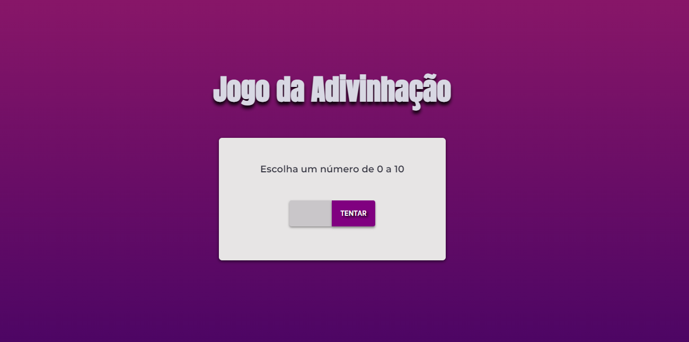

# Projeto 06 | Programa Explorer da Rocketseat

- Desafio: criar um jogo de adivinhação.

[🔗 Clique aqui para acessar](https://alineviana.github.io/jogo-adivinhacao/)

 

> ## 📝 Conceitos estudados
 

- Responsividade
- Animações e transições
- Media queries
- Função Math()
- Template strings/literals
- Condicionais (if/else)
- Funções

 

> ## 🖥️ Tecnologias

 

- HTML5  
- CSS3
- JavaScript

 

